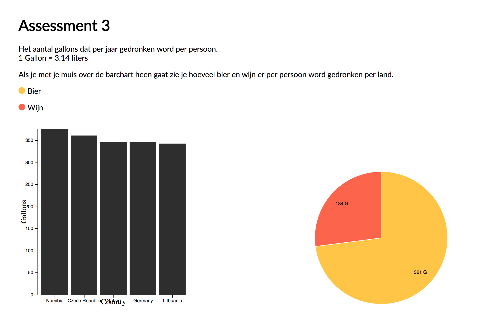

# Assessment 3: Alcohol Consumption


## Beschrijving
Data aanpassen dmv Join, Exit.

## Background
Ik heb voornamelijk mijn data opgeruimd met [replace](https://developer.mozilla.org/en-US/docs/Web/JavaScript/Reference/Global_Objects/String/replace) hier word er gebruikt gemaakt van [regular expressions](https://developer.mozilla.org/en-US/docs/Web/JavaScript/Guide/Regular_Expressions)

## Stappen die ik heb genomen
Gezorgd dat de data klaar staat en daarna veranderd kan worden.

### Enter  & Exit
[Enter](https://medium.com/@c_behrens/enter-update-exit-6cafc6014c36) zorgt ervoor dat de data geupdate kan worden.
[Exit](https://medium.com/@c_behrens/enter-update-exit-6cafc6014c36) zorgt ervoor wanneer de data verdwijnt het ook echt uit de DOM word gehaald.

### Enter
enter wacht nu op de data zodat het geupdate kan worden.
```
var arc = gPie.selectAll(".arc")
.data(pie(data))
.enter().append("g")
  .attr("class", "arc");

};

```

### Mouse over
On mouseover functie geeft de juiste data door aan  de  handleMouseOver functie

```
.on("mouseover", function(d) {
  handleMouseOver([{
    value: d.beer_servings
  },
  {
    value: d.wine_servings
  }])
})
```

### Update
Hier wordt de data geupdate.
```

function handleMouseOver(data){
  var pie = d3.pie()
      .sort(null)
      .value(function(d) {return d.value;});

  var arc = gPie.selectAll(".arc")
    .data(pie(data))


  arc.enter()
    .append("g")
    .attr("class", "arc")

  arc.select("path")
    .transition()
    .duration(500)
    .attr("d", function(d) {
      return pathPie(d)
    } )
    .attr("fill", function(d) {
      return color(d.value);
    });

  arc.select("text")
      .attr("transform", function(d) { return "translate(" + labelPie.centroid(d) + ")"; })
      .attr("dy", "0.35em")
      .text(function(d) {
        return d.value + 'G';
      });

      arc.exit().remove()

}
```


## Dataset
Dataset: https://github.com/fivethirtyeight/data/tree/master/alcohol-consumption

## License
MIT Sam Guliker

## Features
* [scaleBand](https://github.com/d3/d3-scale/blob/master/README.md#scaleBand)
* [rangeRound](https://github.com/d3/d3-scale#band_rangeRound) -
* [data binding](http://alignedleft.com/tutorials/d3/binding-data )
* [domain](https://github.com/d3/d3-scale/blob/master/README.md#quantize_domain)
* [range](https://github.com/d3/d3-scale/blob/master/README.md#quantize_range)
* [ticks](https://github.com/d3/d3-scale/blob/master/README.md#quantize_ticks)
* [scaleOrdinal](https://github.com/d3/d3-scale/blob/master/README.md#scaleOrdinal)
